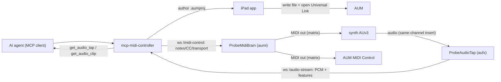

# The agent loop: author → load → play → hear → tweak

How an AI agent drives a synth on the iPad end to end, over the LAN, with no
hardware MIDI in the path. The loop spans this daemon and the `auv3-probe` app's
two AUv3 extensions (`ProbeMidiBrain` = hands, `ProbeAudioTap` = ears).



## The five steps and the tools behind them

| Step | Tool(s) | Notes |
|------|---------|-------|
| 1. Author | `author_loop_session` (or `author_aum_session` + `routes`/`state`/`preset`) | Builds a brain + synth+tap + master `.aumproj`, wires the matrix, embeds both hosts. |
| 2. Load | iPad app "push & open" | Writes the `.aumproj` into AUM's folder, opens `https://kymatica.com/aum/open/<name>.aumproj`. |
| 3. Play | `play_notes`, `send_midi`, `set_transport` | Pushed over `/midi-control` to the brain (LAN); optional BLE fallback. |
| 4. Hear | `get_audio_tap`, `get_audio_clip` | RMS/peak + 48-pt envelope + spectral features + trusted **musical analysis** (f0/note/cents, partials+HNR, loudness/crest, onsets); base64 PCM clip. |
| 5. Tweak | `probe_sound` (set CC + play + analyze in one call), or `send_midi` (CC) then re-`get_audio_tap`; `capture_audio_snapshot` + `compare_audio` for A/B | The CC convention maps synth params → CC; adjust and re-listen. `probe_sound` collapses the three-call loop into one; the compare tools answer "louder/brighter/more harmonic?" with signed deltas. |

## `/midi-control` wire contract (the hands)

`internal/midicontrol` mounts `GET /midi-control` on the shared LAN receiver
(alongside `/audio-stream` and the auv3 probe receiver). ProbeMidiBrain dials in;
the `Hub` tracks the single connected brain and pushes JSON command frames:

```json
{ "type": "noteOn",  "channel": 0, "data1": 60, "data2": 100 }
{ "type": "noteOff", "channel": 0, "data1": 60, "data2": 0 }
{ "type": "cc",      "channel": 0, "data1": 74, "data2": 64 }
{ "type": "pc",      "channel": 0, "data1": 5 }
{ "type": "transportStart" }   // transportStop / transportContinue
```

`channel` is 0-based (wire 0..15); `data1`/`data2` are 0..127. The brain is a
sink — it sends nothing back on the data path. Connect/disconnect is broadcast to
MCP clients via `NotifyMidiControl` (mirrors `NotifyAudioTap`).

The MCP tools target the LAN brain first; `play_notes`/`send_midi`/`set_transport`
accept an optional `transport`/`endpoint` override to fall back to BLE-MIDI via
the engine's `send_raw` path when no brain is connected.

## Audio feedback (the ears)

`get_audio_tap` returns connection state, RMS/peak, a 48-point envelope,
**spectral features** (FFT size, spectral centroid Hz, flatness, and log band
energies, `internal/audiotap/spectral.go`), and a trusted **musical analysis**
block computed in Go over the rolling window (`internal/audiotap/analysis.go`) so
the agent does not have to DSP base64 PCM itself:

- **pitch** — fundamental `f0_hz`, nearest `note`/`midi_note`, `cents` offset, and
  a `confidence` (McLeod NSDF autocorrelation);
- **harmonics** — the strongest spectral `partials` (freq, dBFS, harmonic number)
  with a harmonic-to-noise ratio `hnr_db`;
- **loudness** — `rms_dbfs`/`peak_dbfs` and `crest_db`;
- **onsets** — `onset_count` and `ms_since_onset` (spectral flux).

These fields are surfaced in both the `structuredContent` and the human-readable
text. `get_audio_clip` returns the last *N* ms of decimated mono PCM as base64
`f32le` plus sample rate, for an agent that still wants the raw signal.

### Iterating and comparing

- `probe_sound` is the sound-engineer loop in **one** call: optionally apply
  `settings[]` (a bound-device control or a raw CC over the brain), play
  `notes`/`note` for `duration_ms`, then return the analysis captured **during the
  sustain** (just before note-off, so harmonics/loudness reflect the held tone).
  It also auto-reports a `delta` vs the previous `probe_sound` call.
- `capture_audio_snapshot {label}` stores the current analysis under a label, and
  `compare_audio {a, b}` returns the signed `b - a` deltas (loudness dBFS, pitch
  cents, spectral centroid/flatness, HNR, partial count, onset count) — so an
  agent can deterministically confirm a tweak made the sound louder / brighter /
  more harmonic / detuned.

See `docs/research/auv3-feedback.md` for why audio is the feedback channel (AUM
does not echo MIDI), and `docs/research/sound-engineer-test-loop.md` for the
**mandatory live test loop** (`scripts/sound-loop.sh`) that is the acceptance gate
for these analysis/iterate/compare features against the real iPad/AUM/synth rig.

## Authoring the session (`author_loop_session`)

One call stages a ready-to-run `.aumproj`:

- **ch0 (MIDI strip "Brain")** hosts ProbeMidiBrain, `AuStateDoc`
  `probeMidiBrainConfig = {"host":"<host>","controlEnabled":true}`.
- **ch1 (audio strip "Synth")** hosts the synth in slot 0 and ProbeAudioTap as a
  **same-channel insert** in slot 1, `AuStateDoc`
  `probeAudioTapConfig = {"host":"<host>","streaming":true,"decimation":4}`.
  Optional `synth_preset` sets the synth's `AuPresetCtrl`.
- **ch2 (audio strip "Master")**.
- **Matrix route:** brain `MIDI OUT` (ch0/slot0) → synth (ch1/slot0) **and**
  `BuiltIn:MIDI Control`.

The brain/synth/tap probe ids come from running the `auv3-probe` app once per
plugin (they seed each node's component identity). `host` is the daemon's LAN
`host[:port]`; it is installation-specific and only ever lands in the gitignored
state dir — never committed.

For finer control, `author_aum_session` exposes the same primitives per node:
`routes[]` (matrix), per-node `state` (`AuStateDoc` key → string) and `preset`.
`edit_aum_session` can set `presets`/`configs`/`routes` on an existing staged
session. The matrix + `AuStateDoc` formats are documented in
`docs/research/aum-midi-matrix.md`.

## Loading (push & open)

The iPad app writes the staged `.aumproj` into the linked AUM folder and opens
`https://kymatica.com/aum/open/<name>.aumproj`. AUM loads the session and applies
the authored MIDI matrix, so the brain auto-connects to `/midi-control` and the
tap to `/audio-stream` (both hosts were authored into `AuStateDoc`). One tap and
the loop is live.

## Status / validation

The daemon and app pieces are implemented and unit-tested (matrix + `AuStateDoc`
round-trip in `internal/aum`; both projects build). The remaining check is the
**on-device end-to-end run**: author → push & open → `play_notes` /
`set_transport` → `get_audio_tap` / `get_audio_clip` → tweak CC → re-fetch, on a
trusted device with the extensions installed (`make deploy`). If matrix authoring
proves brittle on a given AUM build, fall back to one-time manual wiring in AUM —
the rest of the loop (control + feedback) still automates.
