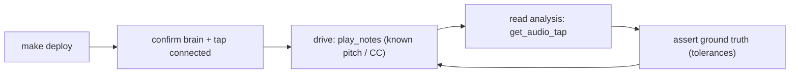

# The sound-engineer live test loop (acceptance gate)

This is the **repeatable live loop** that is the acceptance gate for every Phase 1
sound-engineer feature (richer server-side analysis + the one-call `probe_sound`
iterate loop). It mirrors the manual run the work is built on: deploy, confirm the
hands and ears are connected, play a known note, read the analysis back, and
**assert ground truth** against the real synth in AUM on the iPad, driven over the
LAN.

> **Two tiers, and this is the gate.** The synthetic Go unit tests in
> `internal/audiotap` are the fast inner loop — they drive synthetic signals
> through the analysis (sine at a known f0 -> exact note/cents; noise -> no f0;
> injected transient -> onset) and catch DSP regressions in milliseconds. They do
> **not** prove the end-to-end experience. A feature is "done" only when its
> live-loop acceptance below passes against the running daemon + iPad/AUM/synth.

The harness is `scripts/sound-loop.sh`. It encodes this runbook so anyone (or any
agent) can run the gate without re-deriving it.

## The loop



The physical links matter: the iPad must be on the LAN, a synth must be loaded and
routed in the authored AUM session, and the daemon host's firewall must allow the
LAN receiver port (`:7800`, see `auv3_receiver_addr` in `config.yaml`; the nftables
fix lives in `~/projects/demiurg`). When a precondition fails the harness prints a
**diagnosis** ("ENV issue, not a feature failure") instead of reporting a false
feature regression.

## Quick start

```bash
make deploy                      # build + (re)start the daemon (idempotent)
scripts/sound-loop.sh preflight  # service + ears + hands; diagnoses any gap
scripts/sound-loop.sh run        # preflight + the A4 acceptance assertion
```

Other subcommands:

| Command | What it does |
|---------|--------------|
| `preflight` | Checks the systemd service, the MCP endpoint, the tap (ears) via `get_audio_tap`, and the brain (hands) via the journal. Prints a fix for each gap. |
| `tap` | Dumps the current `get_audio_tap` snapshot (human text + `structuredContent`). |
| `probe [note] [vel] [ms] [ch]` | Plays a note through the brain, then dumps the snapshot. Defaults to A4. |
| `assert-a4` | Plays A4 (MIDI 69) and asserts the ground truth (see below). |
| `run` | `preflight` then `assert-a4` — the gate, suitable for a redeploy smoke test. |
| `deploy` | `make deploy` passthrough. |

Tunable via env: `MCP_ADDR` (default `127.0.0.1:7799`), `CENTS_TOL` (default `15`),
`PROBE_VELOCITY`, `PROBE_DURATION_MS`, `PROBE_CHANNEL`, `SILENCE_RMS`.

## Preconditions (what preflight checks, and how to fix)

1. **systemd user service active** — `mcp-midi-controller.service` is running. Fix:
   `scripts/sound-loop.sh deploy` (or `make deploy`).
2. **MCP endpoint reachable** — the loopback streamable-HTTP endpoint answers on
   `MCP_ADDR`. Fix: check `listen_addr` in `config.yaml`, `make status`.
3. **Audio tap connected (the ears)** — `get_audio_tap` reports `connected: true`
   with a sample rate and a filled window. Fix: load the agent-loop session in AUM
   (`author_loop_session` -> push & open), insert `ProbeAudioTap` on the synth
   channel with streaming on, put the iPad on the LAN, and open `:7800` on the
   daemon host's firewall.
4. **MIDI brain connected (the hands)** — the journal's last `midi-control`
   event is a *connect*. There is no MCP read for brain status, so the harness
   reads the journal (`make logs`). Fix: load the session so `ProbeMidiBrain` dials
   in to `ws://<host>:7800/midi-control`.

A passing preflight looks like:

```
==> 3/4 audio tap (the ears: ProbeAudioTap streaming)
  ok tap connected (ProbeAudioTap @ 12000 Hz, 65536 samples in window)
==> 4/4 midi brain (the hands: ProbeMidiBrain on /midi-control)
  ok brain connected (per journal)
  ok preflight passed — the loop is live
```

## Ground-truth anchors

These are the trusted truths every feature is asserted against. They are reused
across features so the loop stays cheap to run.

| Input (driven via the tools) | Expected analysis (tolerance) |
|------------------------------|-------------------------------|
| Play **A4** (MIDI 69)        | f0 ~ **440 Hz**, nearest note **A4**, within **±15 cents** |
| Play a **C-major triad**     | three lowest partials near **261 / 329 / 392 Hz** (C4/E4/G4) |
| Higher **velocity** (or a "level" CC up) | higher window **dBFS** (louder) |
| "tone/brightness" **CC up**  | higher **spectral centroid** (brighter) |
| A note **attack**            | exactly **one onset** |
| **Silence / white noise**    | no spurious f0 (high flatness, no confident pitch) |

The A4 anchor is the harness's headline assertion (`assert-a4`). It is the cheapest
unambiguous proof the whole chain works: hands -> synth -> ears -> analysis ->
agent-readable number.

## The A4 assertion, and how it tightens over time

`assert-a4` reads the baseline level, plays A4 for `PROBE_DURATION_MS`, then reads
the snapshot back. The window is a rolling ~6 s, so the played note is in the
window when the snapshot is taken (analysis is window-based — timing/flush lag is a
non-issue).

It then asserts in two modes, by design:

- **Strict (pitch) — preferred.** If `get_audio_tap`'s `structuredContent` carries
  an analysis block with a fundamental (`analysis.f0_hz`), the harness derives the
  nearest MIDI note and the cents offset itself and asserts **note == A4** and
  **|cents| <= CENTS_TOL**. It only needs `f0_hz`, so it becomes strict the moment
  `analysis-core` surfaces a fundamental — independent of how the note/cents fields
  are finally named. **This is the contract for `analysis-core` / `analysis-surface`:
  emit `analysis.f0_hz` in the `get_audio_tap` snapshot.**
- **Weak (level) — fallback for today.** Before the analysis block exists, there is
  no f0 to assert, so the harness asserts the weaker-but-real truth that the played
  note produced **signal above the silence floor** (`window_rms` rises from ~0 to a
  clearly audible level). It prints a `NOTE: this is the WEAK gate` warning so no
  one mistakes it for a pitch assertion.

Current live run (pre-`analysis-core`) — the fallback path, passing:

```
==> acceptance: play A4 (MIDI 69 = 440 Hz) and assert the analysis
  played 1 note(s) [69] vel=100 for 800ms on ch1 via brain channel
warn analysis.f0_hz not present yet (pending analysis-core / analysis-surface)
warn   falling back to level check: did A4 produce audible signal?
==>   window_rms: before=8.1e-12 after=0.094 (silence floor 0.005)
  ok level PASS: note produced signal above the silence floor
```

Once `analysis-core` lands, the same command prints the strict pitch result
(`A4 @ 440 Hz, 0.0 cents (±15)`) with no code change to the harness.

## Per-feature live-loop acceptance

Each Phase 1 feature is not "done" until its row passes through this loop:

| Feature | Live-loop acceptance |
|---------|----------------------|
| **analysis-core** | Play A4 -> analysis reports note **A4** within a few cents with confidence; play a chord -> the expected three partials; play silence/noise -> no spurious f0. |
| **analysis-surface** | After a played note, `get_audio_tap` **text** (not just `structuredContent`) shows f0/note/cents and top partials — i.e. the agent no longer needs to parse base64 PCM. |
| **probe-sound-tool** | One `probe_sound` call sets a brightness CC, plays, and returns analysis reflecting the change; confirm it is a **single** round trip replacing the old three. |
| **ab-compare** | Capture A, change a CC, capture B; `compare_audio` reports deltas with the correct sign (louder -> +dBFS, brighter -> +centroid, detuned -> +cents). |

## Definition of done

Run `scripts/sound-loop.sh run`. The loop — not the unit tests alone — is the
definition of done: green preflight, then the A4 assertion passing at its strongest
available mode (pitch once `analysis-core` is in, level before that).
